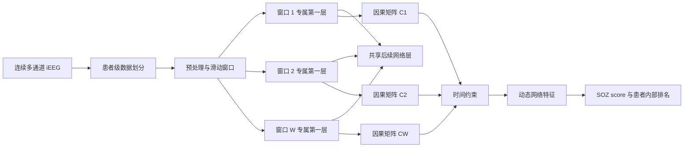

# TC-cMLP

## 1. 研究问题

处理多通道 intracranial electroencephalography（iEEG）信号。设一段记录包含 $p$ 个 channel，在时间 $t$ 的观测表示为

$$
x_t=[x_t^1,x_t^2,\ldots,x_t^p]\in\mathbb R^p.
$$

研究目标是利用各 channel 的历史信号预测当前信号，并从预测模型中提取有方向的 Granger causal influence。模型还需要描述这些因果关系在 seizure 前后怎样随时间变化，最终利用动态网络特征形成 channel-level s eizure onset zone（SOZ）排名。

本文使用的 Granger causality 属于时间序列预测意义上的方向关系。如果 channel $j$ 的历史信息能够提高对 channel $i$ 当前数值的预测能力，就认为 $j\rightarrow i$ 存在 Granger causal influence。该结果需要结合临床 SOZ 标注、影像资料和手术结局进行医学解释。

## 2. 非线性 Granger causality

传统 vector autoregression（VAR）将当前信号写成若干历史信号的线性组合：

$$
x_t=\sum_{k=1}^{K}\Phi_kx_{t-k}+\epsilon_t,
$$

其中 $K$ 表示最大 lag，$\Phi_k$ 表示第 $k$ 个 lag 对应的系数矩阵。iEEG 在 seizure 期间具有明显的非线性和时变特征，因此本文使用神经网络描述历史信号与当前信号之间的关系：

$$
x_t^i=f_i(x_{t-1},x_{t-2},\ldots,x_{t-K})+\epsilon_t^i.
$$

函数 $f_i$ 接收全部 channel 的历史信号，只预测目标 channel $i$ 的当前数值。每个目标 channel 都拥有一个独立预测网络，由此形成 component-wise multilayer perceptron（cMLP）。

## 3. cMLP 的基本结构

对于目标 channel $i$，模型把最近 $K$ 个采样点整理成历史输入：

$$
z_t=[x_{t-1},x_{t-2},\ldots,x_{t-K}]\in\mathbb R^{p\times K}.
$$

第一层计算过程表示为

$$
h_{t,i}^{(1)}=\sigma\left(W_i^{(1)}z_t+b_i^{(1)}\right),
$$

其中 $W_i^{(1)}\in\mathbb R^{H\times p\times K}$，$H$ 是第一层 hidden unit 数量，$\sigma(\cdot)$ 是 nonlinear activation。后续网络层继续变换第一层表示并输出预测值：

$$
\hat{x}_t^i=F_i\left(h_{t,i}^{(1)};\Theta_i\right),
$$

其中 $\Theta_i$ 表示目标 channel $i$ 的后续网络参数。

第一层中与 source channel $j$ 对应的权重组为

$$
W_{i\leftarrow j}^{(1)}\in\mathbb R^{H\times K}.
$$

该权重组同时包含全部 hidden unit 和全部 lag 上的信息。当整组权重等于零时，目标 channel $i$ 的预测不再使用 source channel $j$ 的历史信息，因此模型将 $j\rightarrow i$ 判定为 Granger non-causality。

## 4. 因果强度与 group sparsity

从 source channel $j$ 到 target channel $i$ 的 causal score 定义为

$$
C_{i,j}=\left\|W_{i\leftarrow j}^{(1)}\right\|_F.
$$

矩阵 $C\in\mathbb R^{p\times p}$ 的行表示 target，列表示 source。元素 $C_{i,j}$ 对应 $j\rightarrow i$，该方向约定在模型、代码、图形和统计计算中保持一致。

为了选择关键连接，模型对第一层权重使用 group lasso：

$$
\mathcal L_{\mathrm{group}}
=
\sum_{i=1}^{p}\sum_{j=1}^{p}
\left\|W_{i\leftarrow j}^{(1)}\right\|_F.
$$

该约束以一个 source-target 权重组为处理单位。缺少预测作用的整组权重会被压缩到零，保留下来的非零权重组形成稀疏 Granger causal network。模型仍然保留每个 channel 的自身历史用于预测，但对角线元素不进入 channel 间网络特征的计算。

## 5. 独立滑动窗口方法的局限

为了描述动态网络，可以将连续 iEEG 信号划分为 $W$ 个滑动窗口：

$$
X^{(1)},X^{(2)},\ldots,X^{(W)}.
$$

原始 cMLP 用于滑动窗口时，会在每个窗口中单独训练一个模型。短窗口提供的样本数量有限，相邻窗口得到的因果矩阵容易受到信号噪声、参数初始化和训练波动影响。网络在生理状态接近时也可能表现出明显差异，进而影响变化点分析和 SOZ 排名。

## 6. TC-cMLP 的参数组织方式

Temporally Coupled component-wise MLP（TC-cMLP）联合训练同一段记录中的全部时间窗口。每个窗口拥有专属第一层权重和第一层 bias：

$$
W_{1,i}^{(1)},W_{1,i}^{(2)},\ldots,W_{1,i}^{(W)},
$$

$$
b_{1,i}^{(1)},b_{1,i}^{(2)},\ldots,b_{1,i}^{(W)}.
$$

第一层负责表示每个窗口中的 Granger causal structure。第二层至输出层在全部窗口之间共享，记为

$$
\Theta_i=W_{2:L,i}.
$$

目标 channel $i$ 在窗口 $w$ 中的预测表示为

$$
\hat{x}_t^{i,(w)}
=
F_i\left(
\sigma\left(W_{1,i}^{(w)}z_t^{(w)}+b_{1,i}^{(w)}\right);
\Theta_i
\right).
$$

这种参数组织方式表达了一个研究假设：相邻时间窗口共享主要的非线性预测规律，参与预测的 channel 及其作用强度允许随 seizure 过程发生变化。窗口专属第一层描述动态因果结构，共享后续层利用多个窗口共同学习非线性关系。

## 7. 时间约束

窗口 $w$ 中的动态因果矩阵定义为

$$
C_{i,j}^{(w)}
=
\left\|W_{i\leftarrow j}^{(1,w)}\right\|_F.
$$

TC-cMLP 对相邻窗口的 causal score 加入 total variation 约束：

$$
\mathcal L_{\mathrm{temporal}}
=
\sum_{w=2}^{W}
\left\|C^{(w)}-C^{(w-1)}\right\|_1.
$$

该约束会减少缺少数据依据的窗口间波动，同时允许少量明确的网络变化。平稳时间段中的相邻因果矩阵会保持接近，seizure onset 附近具有足够数据支持的变化仍然可以保留。

## 8. 完整训练目标

TC-cMLP 的训练目标定义为

$$
\mathcal L
=
\mathcal L_{\mathrm{pred}}
+\lambda_s\mathcal L_{\mathrm{group}}
+\lambda_t\mathcal L_{\mathrm{temporal}}
+\lambda_w\mathcal L_{\mathrm{weight}}.
$$

预测误差用于保证模型能够利用历史信号预测当前信号：

$$
\mathcal L_{\mathrm{pred}}
=
\sum_{w=1}^{W}
\sum_{i=1}^{p}
\sum_{t\in\mathcal T_w}
\left(x_t^{i,(w)}-\hat{x}_t^{i,(w)}\right)^2.
$$

group sparsity 用于学习稀疏连接：

$$
\mathcal L_{\mathrm{group}}
=
\sum_{w=1}^{W}
\sum_{i=1}^{p}
\sum_{j=1}^{p}
\left\|W_{i\leftarrow j}^{(1,w)}\right\|_F.
$$

时间约束用于控制相邻窗口之间的 causal score 变化。Weight decay 作用于共享后续层：

$$
\mathcal L_{\mathrm{weight}}
=
\sum_{i=1}^{p}
\sum_{l=2}^{L}
\left\|W_{l,i}\right\|_F^2.
$$

超参数 \(\lambda_s\) 控制网络稀疏程度，\(\lambda_t\) 控制时间连续性，\(\lambda_w\) 控制共享网络参数规模。所有超参数均使用训练患者和验证患者确定。

## 9. 模型训练过程

HUP iEEG 中不同患者的 channel 数量和电极位置不同，因此 TC-cMLP 以 recording 或 seizure 为单位拟合动态因果网络。训练患者和验证患者用于确定窗口长度、overlap、lag、\(\lambda_s\)、\(\lambda_t\)、网络宽度以及 SOZ 判定阈值。测试患者的 TC-cMLP 仅使用其 iEEG 信号拟合，不使用该患者的 SOZ label；临床 label 只参与最终评价。

数据处理从患者级划分开始。每段 recording 完成坏 channel 移除、重参考、滤波、降采样和标准化以后，再生成滑动窗口。全部重叠窗口始终保留在同一患者内部，由此防止相邻窗口进入不同数据集合。

每次参数更新包含预测误差和正则项计算。共享后续层使用全部窗口的预测误差信息更新；窗口专属第一层同时接收预测误差、group sparsity 和时间约束。Group lasso 使用 proximal update，使缺少作用的整组第一层权重能够达到零。训练过程保存 validation loss 最低的模型参数，并检查 NaN、Inf、空窗口和 channel 数量变化。

## 10. 动态网络特征

对于任意窗口 $w$，矩阵元素 $C_{i,j}^{(w)}$ 表示 source channel $j$ 指向 target channel $i$ 的 causal score。Channel $j$ 的 outflow 定义为该矩阵第 $j$ 列除去对角线后的元素之和：

$$
\operatorname{outflow}_j^{(w)}
=
\sum_{i\ne j}C_{i,j}^{(w)}.
$$

Channel $j$ 的 inflow 定义为该矩阵第 $j$ 行除去对角线后的元素之和：

$$
\operatorname{inflow}_j^{(w)}
=
\sum_{i\ne j}C_{j,i}^{(w)}.
$$

Net flow 定义为

$$
\operatorname{netflow}_j^{(w)}
=
\operatorname{outflow}_j^{(w)}
-\operatorname{inflow}_j^{(w)}.
$$

Outflow 描述 channel $j$ 对其他 channel 发出的因果影响，inflow 描述 channel $j$ 接收的因果影响，net flow 描述发出影响和接收影响之间的差值。本文将 outflow 作为主要 SOZ 特征，inflow 和 net flow 用于补充分析与消融研究。

## 11. SOZ score 与定位规则

SOZ 定位在患者内部完成。模型在每个窗口中计算全部 channel 的 outflow，并将排名位于前 $K\%$ 的 channel 标记为该窗口的候选 channel。随后统计每个 channel 的平均异常强度、异常窗口数量、异常窗口比例和最长连续异常时长。

Channel-level SOZ score 由 outflow 排名、异常强度和持续性共同形成。具体组合方式以及最终判定阈值只使用训练患者和验证患者确定，然后完整应用于测试患者。该流程减少单个窗口异常波动对定位结果的影响，并使 SOZ 判定依据能够追溯到连续时间上的网络变化。

模型直接输出 channel-level SOZ 排名。Epileptogenic zone（EZ）属于更广泛的临床概念，论文在医学讨论中结合 SOZ、resection or ablation channel、影像资料和 Engel outcome 分析模型结果。

## 12. 方法输出

每段 recording 经过 TC-cMLP 处理后产生连续窗口的动态因果矩阵

$$
C^{(1)},C^{(2)},\ldots,C^{(W)},
$$

每个 channel 的动态 outflow、inflow 和 net flow 时间序列，以及患者内部的 SOZ score、channel 排名和最终预测结果。实验程序还需要保存窗口时间范围、seizure onset 相对时间、模型配置、随机种子、训练记录和评价指标，以支持重复运行和结果核查。
